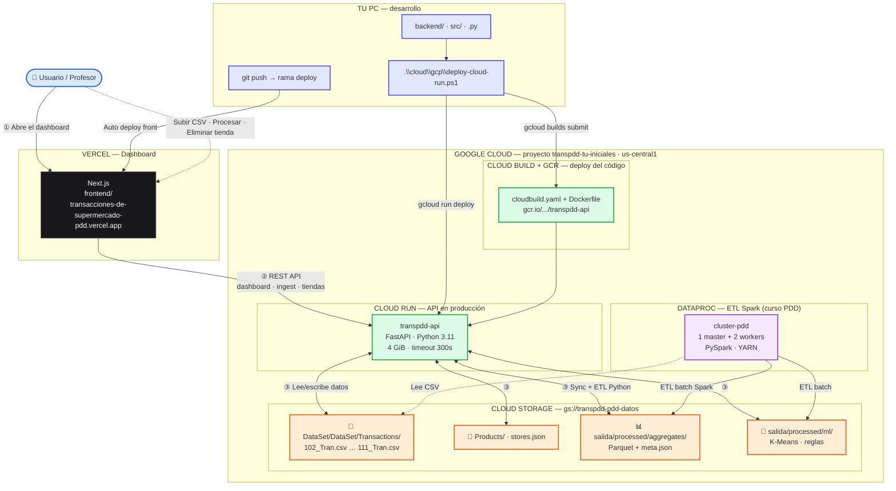
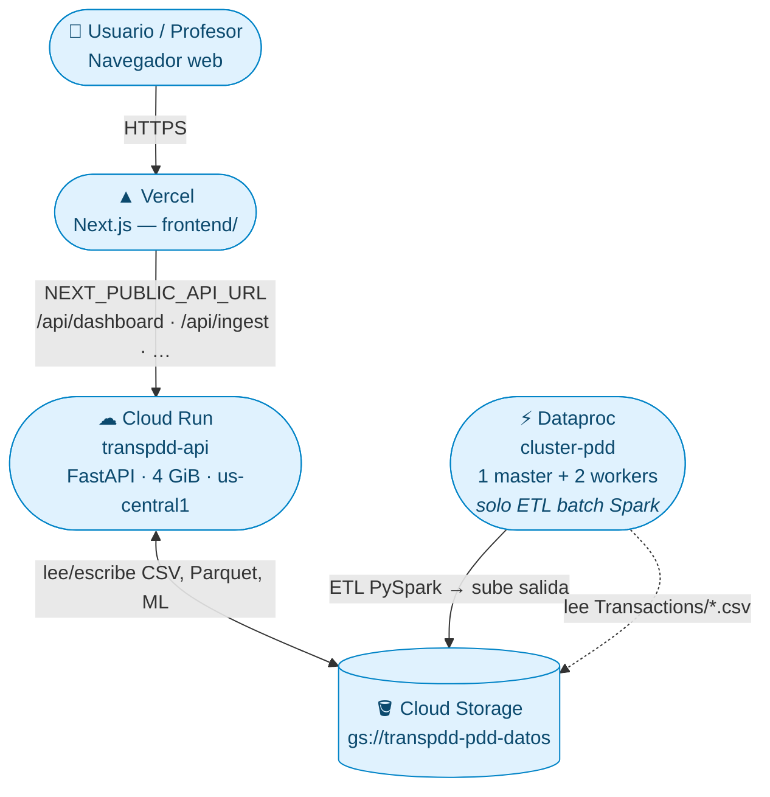
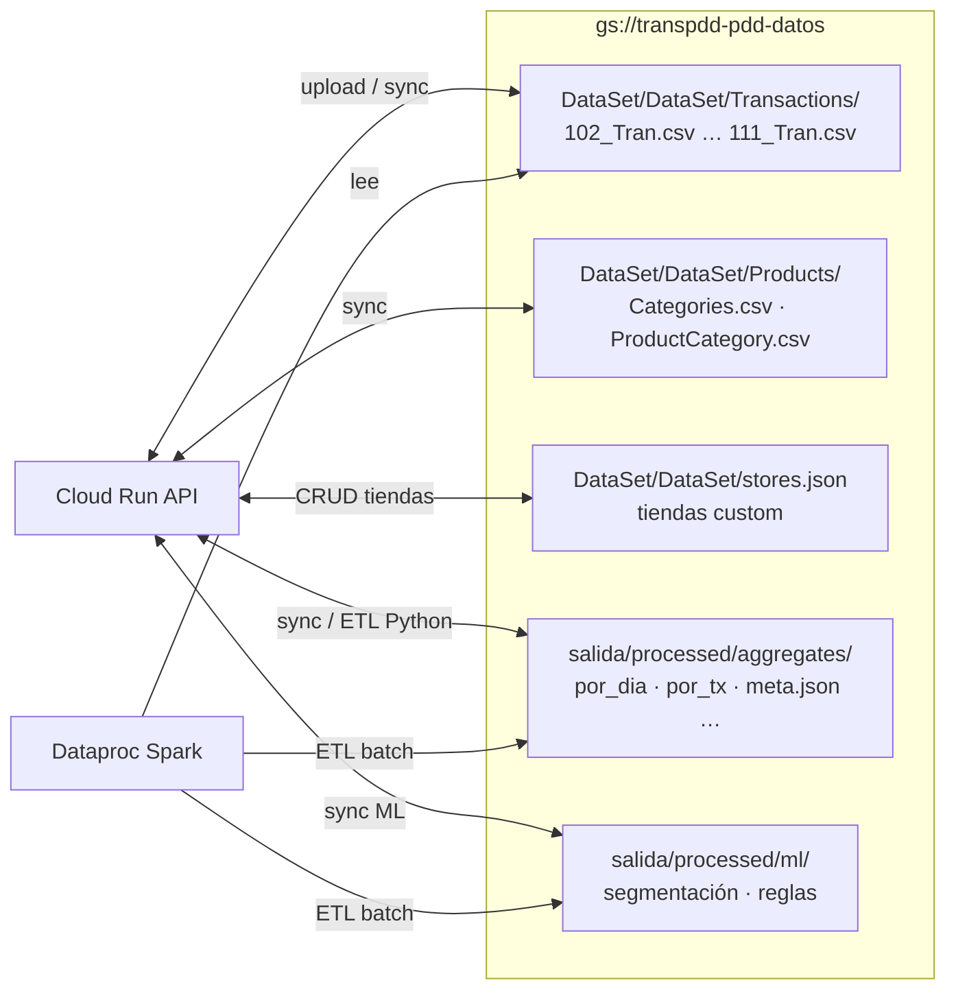
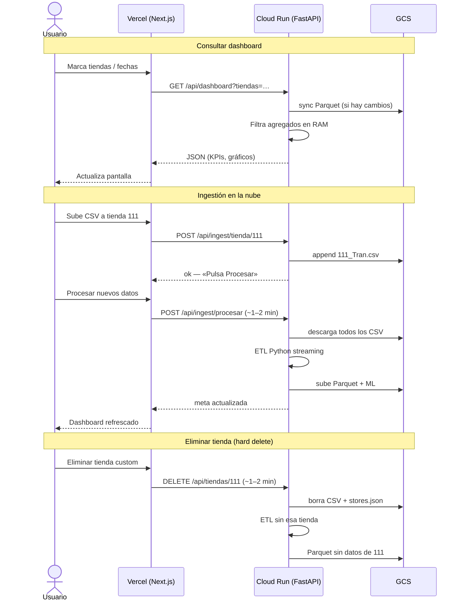
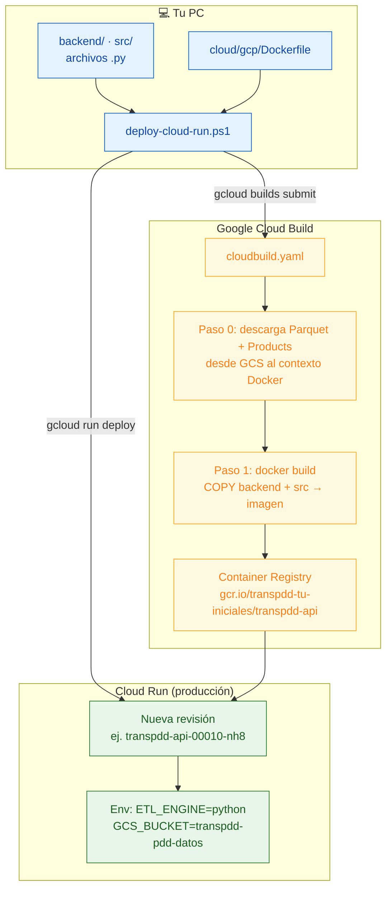
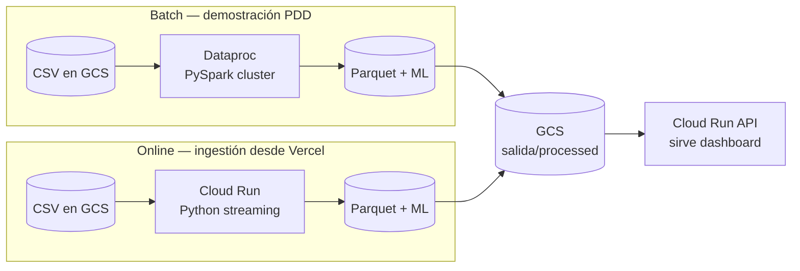
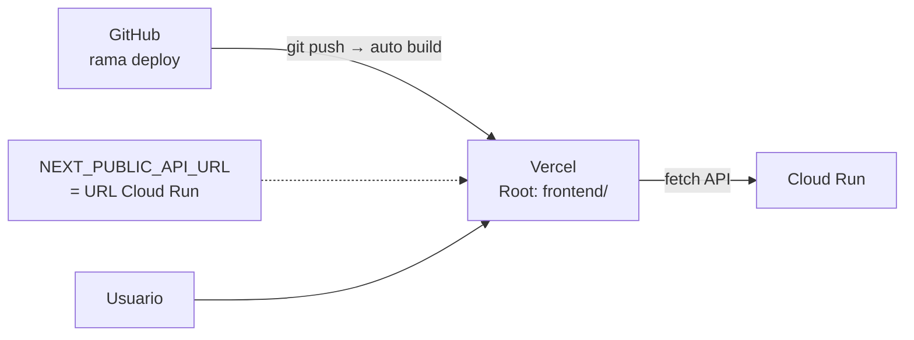

# Diagrama de despliegue en la nube

Arquitectura del proyecto **Transacciones-de-supermercado-PDD** en producción (GCP + Vercel).

---

## ⭐ Diagrama único — toda la arquitectura

**Archivo:** `docs/diagrama-deploy-nube.md` (este archivo, sección de abajo).

**Cómo verlo / exportarlo a PNG para la presentación:**

| Opción | Dónde |
|--------|--------|
| **A — Cursor / VS Code** | Abre este archivo → `Ctrl+Shift+V` (vista previa Markdown) |
| **B — Web (mejor para PNG)** | Copia el bloque `mermaid` de abajo → [mermaid.live](https://mermaid.live) → **Actions → Export PNG/SVG** |
| **C — Desde la guía** | `docs/despliegue-gcp-spark.md` tiene el enlace a este doc |



### Leyenda rápida

| Flecha | Significado |
|--------|-------------|
| ① Usuario → Vercel | Entra al dashboard público |
| ② Vercel → Cloud Run | El front llama a la API (`NEXT_PUBLIC_API_URL`) |
| ③ Cloud Run ↔ GCS | CSV, Parquet y ML; fuente de verdad en el bucket |
| Dataproc → GCS | ETL **Spark** del curso (batch, cluster con workers) |
| Tu PC → Cloud Build → Cloud Run | Cómo subes cambios de `.py` (`deploy-cloud-run.ps1`) |
| git push → Vercel | Cómo subes cambios del **frontend** (rama `deploy`) |

---

## 1. Vista general — ¿quién habla con quién?



| Componente | URL / recurso | Rol |
|------------|---------------|-----|
| **Vercel** | `transacciones-de-supermercado-pdd.vercel.app` | Dashboard, filtros, gráficos |
| **Cloud Run** | `transpdd-api-….us-central1.run.app` | API REST + ETL Python en la nube |
| **Cloud Storage** | `gs://transpdd-pdd-datos` | Fuente de verdad (CSV, Parquet, tiendas) |
| **Dataproc** | `cluster-pdd` (apagable tras ETL) | ETL distribuido con **Spark** (curso PDD) |

---

## 2. Dentro del bucket GCS — qué guarda cada carpeta



---

## 3. Flujo en tiempo de ejecución — dashboard e ingestión



---

## 4. Flujo de deploy — ¿cómo llega tu código `.py` a la nube?

**La nube no ve los archivos de tu PC solos.** Hay que empaquetar y desplegar.



### Comando que dispara todo

```powershell
.\cloud\gcp\deploy-cloud-run.ps1
```

### Qué hace cada paso

| Paso | Herramienta | Resultado |
|------|-----------|-----------|
| 1 | `gcloud builds submit` | Sube el repo a Cloud Build |
| 2 | `cloudbuild.yaml` | Descarga datos base de GCS + construye imagen Docker |
| 3 | `Dockerfile` | Instala deps, copia `backend/` y `src/` dentro de la imagen |
| 4 | Push a GCR | Imagen versionada en `gcr.io/.../transpdd-api` |
| 5 | `gcloud run deploy` | Nueva revisión con 4 GiB RAM, timeout 300 s |

---

## 5. Dos motores ETL — Spark (curso) vs Python (Cloud Run)



| Motor | Dónde corre | `meta.json` → `etl_engine` | Cuándo usarlo |
|-------|-------------|----------------------------|---------------|
| **Spark** | Dataproc (2 workers) | `spark-cluster` | Entrega del curso, ETL masivo distribuido |
| **Python** | Cloud Run | `python-streaming-gcs` | Subir CSV, Procesar, Eliminar tienda desde el front |

---

## 6. Deploy del frontend (Vercel) — separado de la API



- **API:** se actualiza con `deploy-cloud-run.ps1` (Docker + Cloud Run).
- **Front:** se actualiza con **push a GitHub** → Vercel rebuild automático.
- Son **dos pipelines independientes**.

---

## Resumen en una frase

**Los datos viven en GCS; el código vive en imágenes Docker en Cloud Run; el usuario entra por Vercel; el ETL pesado de Spark corre en Dataproc; el reproceso desde el dashboard corre en Cloud Run.**
