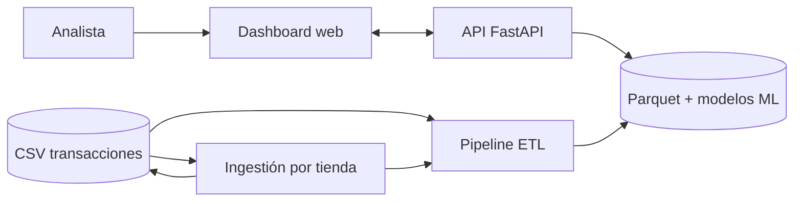
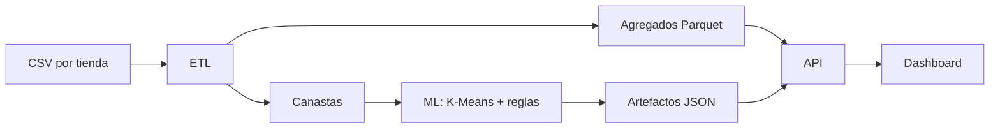
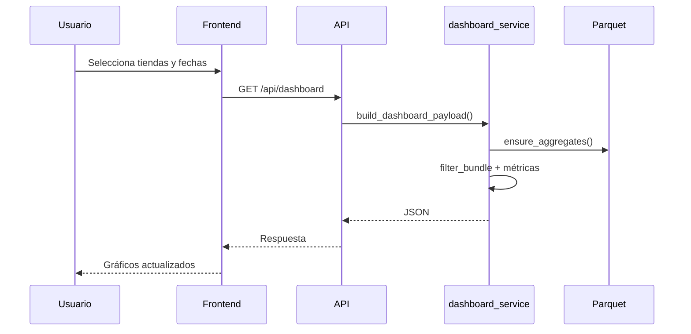
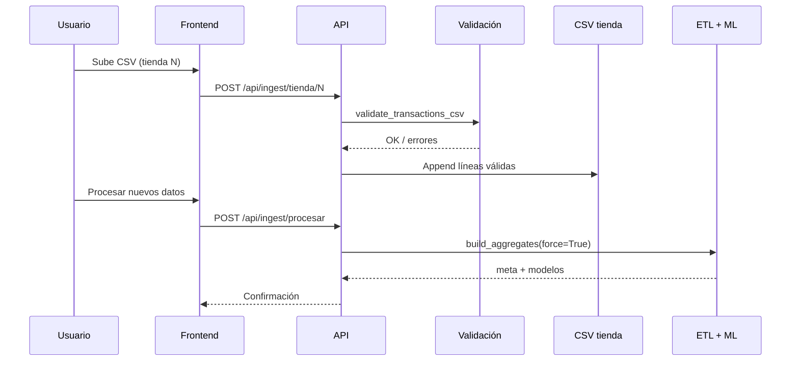

# Arquitectura del sistema

## Contexto



El usuario interactúa únicamente con el dashboard. La API centraliza el acceso a agregados y modelos. El ETL transforma CSV en tablas analíticas; la ingestión amplía los CSV existentes y dispara un nuevo ciclo ETL.

---

## Capas

| Capa | Tecnología | Responsabilidad |
|------|------------|-----------------|
| Presentación | Next.js, React, Recharts | Filtros, visualización, carga de datos |
| Aplicación | FastAPI | Endpoints REST, orquestación |
| Procesamiento | PySpark / Python, scikit-learn | ETL, métricas, K-Means, reglas de asociación |
| Persistencia | Parquet, JSON | Agregados y artefactos ML en disco |

---

## Flujo de datos



### Entrada

Archivos `{tienda}_Tran.csv` con formato pipe-separated. Catálogo en `Products/Categories.csv` y `Products/ProductCategory.csv`.

### ETL (`src/etl/`)

| Módulo | Función |
|--------|---------|
| `load_transactions.py` | Punto de entrada; elige Spark o Python streaming |
| `spark_load_transactions.py` | Agregaciones con PySpark `local[*]` |
| `dashboard_data.py` | Carga y filtrado de Parquet para la API |
| `ingest_validation.py` | Validación de CSV en ingestión |

Salidas principales: `por_dia`, `por_categoria`, `por_cliente`, `por_tx`, `canastas`, `meta.json`.

### Modelos (`src/ml/`)

| Módulo | Función |
|--------|---------|
| `segmentation.py` | K-Means (k=4) sobre métricas por cliente; exporta perfiles y scatter PCA |
| `recommender.py` | Reglas de co-ocurrencia entre categorías en canastas |
| `pipeline.py` | Orquestación del entrenamiento post-ETL |

### API (`backend/`)

| Módulo | Función |
|--------|---------|
| `main.py` | Rutas HTTP, CORS |
| `dashboard_service.py` | Construcción del payload del dashboard |
| `ml_service.py` | Segmentación, recomendaciones, ingestión |

### Frontend (`frontend/`)

| Ruta / componente | Función |
|-------------------|---------|
| `app/page.tsx` | Layout, pestañas, estado de filtros |
| `components/Sidebar.tsx` | Filtros e ingestión |
| `components/ResumenTab.tsx` | KPIs ejecutivos |
| `components/AnalyticsTab.tsx` | Gráficos analíticos |
| `components/SegmentacionTab.tsx` | Clusters |
| `components/RecomendadorTab.tsx` | Recomendaciones |
| `lib/api.ts` | Cliente HTTP hacia la API |

---

## Secuencia: consulta con filtros



---

## Secuencia: ingestión de nuevos datos



---

## Mapa de directorios

```
Transacciones-de-supermercado/
├── backend/                 # API REST
├── frontend/                # Dashboard Next.js
├── src/
│   ├── etl/                 # ETL, validación, acceso a Parquet
│   ├── metrics/             # Cálculo de KPIs
│   └── ml/                  # Segmentación y recomendador
├── DataSet/DataSet/         # CSV fuente (local)
├── data/processed/          # Generado por ETL (local)
└── docs/                    # Documentación
```

---

## Decisiones de diseño

**ETL batch vs. consulta en vivo.** Spark procesa millones de filas una vez; la API filtra agregados precomputados. Esto mantiene el dashboard responsive.

**Categorías vs. productos.** El dataset no incluye precios ni SKU uniforme en todas las tiendas. La tienda 102 usa categorías directas; las demás se normalizan vía `ProductCategory.csv`.

**Recomendador por co-ocurrencia.** Se eligió conteo de pares en canastas en lugar de Apriori con matriz one-hot, por límites de memoria con ~1M tickets.

**Ingestión append-only.** Los nuevos lotes se concatenan al CSV de la tienda correspondiente, alineado con el requisito de incorporar datos sin crear nuevas sucursales.
