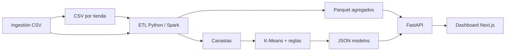

# Informe técnico — Análisis y modelado analítico de transacciones de supermercado

**Proyecto:** Transacciones de supermercado (PDD)  
**Periodo analizado:** 1 de enero – 30 de junio de 2013  
**Tiendas:** 102, 103, 107, 110  
**Fecha del informe:** 5 de junio de 2026  
**Motor ETL utilizado para este informe:** Python streaming (`ETL_ENGINE=python`)

---

## Resumen

Se procesaron **1.062.776 transacciones** (tras prueba de ingestión de 3 líneas adicionales en tienda 102), **8.794.689 unidades** vendidas y **154.045 clientes** únicos (clave tienda + cliente). La solución materializa agregados en Parquet, expone un dashboard web y entrena modelos de **segmentación K-Means (k = 4)** y **recomendación por co-ocurrencia de categorías** (1.250 reglas). Las métricas son relativas (volumen, frecuencia, diversidad), dado que el dataset **no incluye precios ni montos de pago**.

---

## i. Descripción de los datos

### Origen y alcance

Los datos provienen de archivos CSV del curso, organizados por punto de venta:

| Archivo | Tienda | Rol |
|---------|--------|-----|
| `102_Tran.csv` | 102 | Ítems = **ID de categoría** (1–50) |
| `103_Tran.csv`, `107_Tran.csv`, `110_Tran.csv` | 103, 107, 110 | Ítems = **SKU** → categoría vía `ProductCategory.csv` |

Catálogo auxiliar:

- **`Categories.csv`:** 50 categorías (`id|nombre`), p. ej. *CARNES PROCESADAS AL VACIO*, *LECHE LIQUIDA*.
- **`ProductCategory.csv`:** mapeo `sku|categoria` para normalizar tickets de tiendas 103, 107 y 110.

### Formato de cada transacción

Sin encabezado, separador `|`:

```text
fecha|tienda|id_cliente|item1 item2 item3 ...
2013-01-01|102|530|20 3 1
```

- **Fecha:** `AAAA-MM-DD`
- **Repetición de un número en la lista de ítems:** mayor cantidad de unidades de esa categoría/SKU en el ticket
- **ID de transacción (generado en ETL):** `{tienda}-{fecha}-{número_de_línea}`

### Variables derivadas en el sistema

| Variable | Descripción |
|----------|-------------|
| `unidades` / `cantidad` | Suma de ítems por ticket, categoría o cliente |
| `n_transacciones` | Conteo de tickets |
| `n_categorias` | Categorías distintas compradas por cliente |
| `frecuencia_semanal` | `n_transacciones / (días_activos / 7)` |
| `categorias` (canasta) | Categorías únicas por ticket (base del recomendador) |

### Volumen global (post-ETL)

| Indicador | Valor |
|-----------|------:|
| Unidades vendidas (total ventas) | 8.794.689 |
| Transacciones | 1.062.776 |
| Clientes (tienda + cliente) | 154.045 |
| Rango temporal | 2013-01-01 → 2013-06-30 |

### Distribución por tienda

| Tienda | Transacciones | Clientes únicos |
|--------|-------------:|----------------:|
| 103 | 381.972 | 61.149 |
| 102 | 314.289 | 44.595 |
| 107 | 240.188 | 30.808 |
| 110 | 126.327 | 17.493 |

La tienda **103** concentra el mayor volumen transaccional; la **110** el menor en el semestre.

### Limitaciones del dataset

1. **No hay precios ni ingresos:** “Rentabilidad” y rankings se interpretan como **volumen relativo** o **frecuencia**.
2. **Granularidad heterogénea:** en 102 las líneas son categorías; en otras tiendas son SKU normalizados a categoría. El dashboard y el recomendador operan a nivel **categoría (1–50)**.
3. **KPI de clientes en dashboard vs. meta:** el resumen ejecutivo cuenta clientes **únicos por `id_cliente`** (128.017 en vista global); el ETL cuenta **pares (tienda, cliente)** (154.045), coherente con IDs que pueden repetirse entre tiendas.

### Nota operativa (ubicación de archivos)

Los CSV estaban en `DataSet/DataSet/DataSet/` en lugar de `DataSet/DataSet/`. Se crearon **enlaces de directorio (junction)** hacia `Transactions/` y `Products/` para que el ETL los encuentre sin mover los archivos originales.

---

## ii. Metodología de análisis

### Arquitectura de la solución



1. **ETL (`src/etl/load_transactions.py`):** lectura línea a línea, normalización a categorías, agregación a tablas `por_dia`, `por_semana`, `por_categoria`, `por_cliente`, `por_tx`, `canastas`.
2. **Métricas ejecutivas (`src/metrics/executive_summary.py`):** KPIs y tops sobre agregados filtrados por tienda y fecha.
3. **Dashboard (`backend/dashboard_service.py`):** series temporales, boxplots por cliente, heatmaps de correlación y actividad día × mes.
4. **ML (`src/ml/`):** entrenamiento automático tras cada ETL completo.
5. **Ingestión (`POST /api/ingest/tienda/{id}` + `POST /api/ingest/procesar`):** validación, append al CSV existente y reprocesamiento.

### Analítica descriptiva y diagnóstica

- **Indicadores absolutos relativos:** unidades y conteos de transacciones/clientes.
- **Rankings:** top 10 categorías y clientes por volumen o frecuencia.
- **Temporal:** series diarias y semanales; heatmap día de semana × mes.
- **Distribución:** boxplot del tamaño de canasta (`cantidad` por ticket) para clientes con más actividad.
- **Correlación:** matriz de Pearson entre `n_transacciones`, `unidades`, `n_categorias` y `frecuencia_semanal` a nivel cliente.

### Segmentación (K-Means)

| Parámetro | Valor |
|-----------|-------|
| Algoritmo | K-Means (`sklearn`, `k=4`, `random_state=42`) |
| Escalado | `StandardScaler` |
| Variables | `n_transacciones`, `unidades`, `n_categorias`, `frecuencia_semanal` |
| Visualización | Proyección PCA 2D (800 puntos muestreados en API) |
| Etiquetado | Heurístico según centroides vs. mediana |

### Recomendador

- **Método:** co-ocurrencia de pares de categorías en canastas (alternativa ligera a Apriori sobre matriz one-hot grande).
- **Muestra de entrenamiento:** hasta 80.000 canastas aleatorias.
- **Umbral:** confianza mínima 0,08; top 25 reglas por categoría antecedente.
- **Salida:** sugerencias de **categorías** complementarias, con *score* (lift acumulado) y *confidence*.

### Incorporación de nuevos datos

Flujo validado en este informe:

1. Validar CSV (UTF-8, formato, tienda permitida, ≥95 % líneas válidas).
2. **Solo** append a `{tienda}_Tran.csv` si la tienda ∈ {102, 103, 107, 110}.
3. `build_aggregates(force=True)` + reentrenamiento ML.

---

## iii. Principales hallazgos visuales

### Resumen ejecutivo (KPIs globales, ene–jun 2013)

| Indicador | Valor | Interpretación |
|-----------|------:|------------------|
| Total de ventas (unidades) | 8.794.689 | Volumen físico agregado del semestre |
| Número de transacciones | 1.062.776 | ~8,3 unidades por ticket en promedio |
| Clientes (id único en dashboard) | 128.017 | Base amplia con compra esporádica o recurrente |

### Top 10 categorías por unidades

| # | Categoría | Unidades |
|---|-----------|--------:|
| 1 | CARNES PROCESADAS AL VACIO | 1.431.357 |
| 2 | CUIDADO DE LA ROPA | 1.069.818 |
| 3 | JUGOS | 607.381 |
| 4 | PASTAS COMESTIBLES | 392.116 |
| 5 | AROMATICAS MEDICINALES | 348.508 |
| 6 | LECHE LIQUIDA | 290.313 |
| 7 | CUIDADO DE LA COCINA | 280.825 |
| 8 | AREPAS | 224.159 |
| 9 | HUEVOS | 213.858 |
| 10 | PASABOCAS | 212.480 |

**Lectura:** carnes al vacío y cuidado del hogar dominan el volumen; categorías de refrigerados y despensa aparecen en segundo plano. Sin precios, esto refleja **popularidad/volumen**, no margen económico.

### Top 10 clientes por número de transacciones

| # | ID cliente | Transacciones |
|---|------------|----------------:|
| 1 | 336296 | 464 |
| 2 | 440157 | 163 |
| 3 | 806377 | 159 |
| 4 | 576930 | 157 |
| 5 | 525328 | 148 |
| 6 | 307063 | 147 |
| 7 | 517807 | 144 |
| 8 | 908225 | 131 |
| 9 | 51733 | 130 |
| 10 | 458679 | 128 |

El cliente **336296** es un outlier de frecuencia (464 tickets en seis meses); conviene revisar si corresponde a hogar, negocio o error de registro.

### Días pico y valle de compra

**Picos (más transacciones en un día):**

| Fecha | Transacciones |
|-------|-------------:|
| 2013-06-15 | 9.000 |
| 2013-05-11 | 8.287 |
| 2013-02-03 | 8.225 |
| 2013-03-03 | 8.127 |
| 2013-06-01 | 8.059 |

**Valles:**

| Fecha | Transacciones |
|-------|-------------:|
| 2013-01-01 | 2.751 |
| 2013-05-22 | 3.546 |
| 2013-03-29 | 3.808 |

**Patrón semanal:** sábado (180.778) y domingo (184.182) superan a días laborables; miércoles es el más bajo (131.192). Coherente con compra de fin de semana en retail.

**Heatmap día × mes:** junio y febrero muestran mayor actividad en sábados/domingos; enero presenta picos entre semana en algunos días (p. ej. lunes ene ~30k vs. viernes ~20k en la matriz agregada).

### Serie de tiempo

- Tendencia estable con **estacionalidad semanal** marcada.
- Picos puntuales alineados con fines de semana de mitad de mes y fechas de alto tráfico (p. ej. 15-jun).
- 1 de enero cae por feriado / menor apertura efectiva.

### Boxplot (tamaño de canasta por cliente top)

Ejemplos del dashboard (unidades por ticket):

| Cliente | Mediana canasta | Rango típico (Q1–Q3) |
|---------|----------------:|----------------------|
| C684690 | 31,5 | 28 – 35 (canastas grandes y estables) |
| C440157 | 8,0 | 6 – 11,5 |
| C336296 | 2,5 | 1 – 5 (muchas visitas, canastas pequeñas) |

**Diagnóstico:** coexisten perfiles de “compra grande poco frecuente” y “compra pequeña muy frecuente”; el boxplot ayuda a separar outliers de volumen por ticket vs. por frecuencia.

### Heatmap de correlación (métricas por cliente)

|  | N° tx | Unidades | N° categorías | Frec. semanal |
|--|:-----:|:--------:|:-------------:|:-------------:|
| **N° tx** | 1,00 | 0,86 | 0,67 | **−0,34** |
| **Unidades** | 0,86 | 1,00 | 0,72 | −0,30 |
| **N° categorías** | 0,67 | 0,72 | 1,00 | **−0,53** |
| **Frec. semanal** | −0,34 | −0,30 | −0,53 | 1,00 |

**Interpretación:**

- Frecuencia de visitas y volumen total van **muy ligados** (r ≈ 0,86).
- La **frecuencia semanal** correlaciona **negativamente** con volumen y diversidad: clientes con pocas visitas en pocos días tienen frecuencia semanal alta artificialmente; clientes intensivos abarcan más días del periodo y bajan esa ratio.
- La diversidad de categorías acompaña al volumen, pero no explica toda la variación (r ≈ 0,67).

---

## iv. Resultados del modelo de segmentación y recomendación

### A. Segmentación de clientes (K-Means, k = 4)

**Población segmentada:** 154.045 clientes (tras ingestión de prueba).

| Cluster | Etiqueta | % clientes | Tx prom. | Unidades prom. | Categorías prom. | Frec. semanal prom. |
|--------:|----------|----------:|---------:|---------------:|-----------------:|--------------------:|
| 0 | Compradores ocasionales | 40,1 % | 4,4 | 23,5 | 11,1 | 0,44 |
| 1 | Visitas frecuentes, canasta moderada | 34,1 % | 1,0 | 5,5 | 4,6 | 6,97 |
| 2 | Clientes intensivos | 20,6 % | 13,7 | 126,7 | 27,3 | 0,66 |
| 3 | Clientes intensivos (élite) | 5,3 % | 37,5 | 375,3 | 33,5 | 1,53 |

**Descripción por grupo:**

1. **Compradores ocasionales (40 %):** núcleo masivo con pocas visitas y canasta media-baja; foco en activación y promociones de entrada.
2. **Visitas frecuentes, canasta moderada (34 %):** muchas compras de una sola visita registrada o visitas muy espaciadas con alta frecuencia semanal calculada; típico de cliente de conveniencia o ticket pequeño repetido.
3. **Clientes intensivos (21 %):** alto volumen y amplia diversidad; candidatos a programas de fidelización y surtido premium.
4. **Élite intensiva (5 %):** super-compradores (≈38 tickets, ≈375 unidades); priorizar retención, atención personalizada y detección de fraude/abuse.

**Visualización:** scatter PCA 2D coloreado por `cluster_id` (800 puntos en API para rendimiento). Los clusters 2 y 3 comparten etiqueta automática “Clientes intensivos” pero difieren fuertemente en centroides; conviene renombrar el cluster 3 a “Super-compradores” en futuras iteraciones.

### B. Recomendador de productos (categorías)

**Entrenamiento:** 68.868 canastas con ≥2 categorías; **1.250 reglas** con confianza ≥ 0,08.

#### Dado un producto/categoría — ejemplo **GALLETAS (13)**

| Categoría sugerida | Lift (score) | Confianza |
|--------------------|-------------:|----------:|
| TORTAS Y PORQUES | 6,84 | 0,22 |
| GRANOS | 6,27 | 0,24 |
| PASTAS COMESTIBLES | 6,23 | 0,27 |
| SOPAS-CREMAS-CALDOS | 5,96 | 0,21 |
| SALSAS | 5,85 | 0,28 |

**Uso:** exhibición cruzada en góndola de panadería/repostería y bundles de despensa.

#### Dado un producto/categoría — ejemplo **LECHE LIQUIDA (10)**

| Categoría sugerida | Lift | Confianza |
|--------------------|-----:|----------:|
| PASTAS COMESTIBLES | 1,99 | 0,09 |
| BEBIDAS INSTANTÁNEAS | 1,86 | 0,18 |
| PAPEL HIGIENICO | 1,85 | 0,08 |
| ENLATADOS | 1,85 | 0,12 |
| CEREALES | 1,81 | 0,36 |

Patrón de **canasta de hogar** (desayuno + aseo + despensa).

#### Dado un cliente — ejemplo **cliente 19** (6 transacciones)

| Categoría sugerida | Score |
|--------------------|------:|
| AREPAS | 11,56 |
| CEREALES | 10,00 |
| CONDIMENTOS | 6,58 |
| MARGARINAS | 6,36 |
| CREMAS DENTALES | 5,01 |

**Nota:** para el cliente con más transacciones del dataset (336296), el recomendador puede devolver **lista vacía** si ya compró todas las categorías asociadas en su historial (reglas solo sugieren categorías no presentes en su canasta).

### C. Generación de nuevos resultados (verificación funcional)

Pruebas ejecutadas el 3-jun-2026:

| Prueba | Resultado esperado | Resultado obtenido |
|--------|-------------------|-------------------|
| Ingestión tienda 999 | Rechazo | OK — validación falla |
| Ingestión 3 líneas tienda 102 | Append + reproceso | OK — transacciones 1.062.773 → 1.062.776 (+3) |
| `ml_ready` tras reproceso | true | OK |
| `recommender_ready` | true | OK |
| Segmentación tras ingestión | 4 clusters, 154.045 clientes | OK |
| Recomendación cliente nuevo 999999001 | ≥1 categoría | OK (GALLETAS, VERDURAS, ENLATADOS) |
| API `/api/health` | aggregates + ml | OK |
| API `/api/recomendaciones/categoria?id_categoria=13` | JSON con recomendaciones | OK |

**Restricción confirmada:** la ingestión **no crea tiendas nuevas**; solo amplía CSV existentes de 102, 103, 107 u 110. Tiendas o archivos inexistentes devuelven error 400/404.

---

## v. Conclusiones y posibles aplicaciones empresariales

### Conclusiones

1. El negocio muestra **alto volumen en categorías de proteína procesada y cuidado del hogar**, útil para negociación con proveedores y planificación de inventario, aunque no sustituye análisis de margen sin datos de precio.
2. La demanda es **claramente semanal**, con fines de semana críticos para dotación de personal y reposición; los picos diarios exigen capacidad logística en fechas puntuales (p. ej. mediados de junio).
3. La base de clientes es **heterogénea**: ~40 % ocasionales y ~5 % super-compradores que concentran valor relativo en unidades; las estrategias no pueden ser únicas.
4. La correlación negativa entre frecuencia semanal y volumen obliga a **definir bien las variables** al segmentar (el modelo K-Means ya separa el grupo de “una visita, alta frecuencia calculada”).
5. El recomendador por categorías es **operativo y escalable**; es adecuado para campañas de cross-selling cuando no hay SKU unificado ni precios.

### Aplicaciones empresariales

| Área | Aplicación |
|------|------------|
| **Marketing** | Campañas diferenciadas por cluster (ocasionales vs. intensivos); bundles basados en reglas (leche + cereales, galletas + tortas). |
| **Operaciones / tienda** | Refuerzo de personal sábado-domingo; preparación anticipada en días pico detectados por serie temporal. |
| **Category management** | Priorizar surtido y espacio en categorías líderes por volumen; evaluar subcategorías débiles. |
| **CRM / fidelización** | Identificar super-compradores (cluster 3) para beneficios exclusivos; reactivar ocasionales (cluster 0). |
| **E-commerce / apps** | Motor de “también te puede interesar” por categoría y por historial de cliente. |
| **Data ops** | Pipeline de ingestión por tienda para ir incorporando ventas nuevas sin redeploy (requisito del enunciado). |

### Trabajo futuro recomendado

- Incorporar **precios o márgenes** cuando existan, para “categorías más rentables” en sentido financiero.
- Unificar etiquetas de clusters 2 y 3 en la UI.
- Evaluar **silueta** o método del codo para validar k = 4.
- Extender ingestión con auditoría (log de líneas rechazadas) y soporte de tiendas nuevas si el negocio lo requiere.

---

## Anexos

### Cómo reproducir este informe

```powershell
# Desde la raíz del proyecto (dataset en DataSet/DataSet/Transactions)
$env:ETL_ENGINE = "python"
python -m venv venv
.\venv\Scripts\pip install pandas pyarrow scikit-learn joblib fastapi uvicorn python-multipart
.\venv\Scripts\python -m src.etl.load_transactions
.\venv\Scripts\uvicorn backend.main:app --port 8000
# Frontend: cd frontend && npm run dev
```

### Referencias del repositorio

- Arquitectura: [arquitectura.md](./arquitectura.md)
- Instalación: [instalacion.md](./instalacion.md)
- Manual de usuario (ingestión): [manual-usuario.md](./manual-usuario.md)
- Métricas exportadas para este documento: `data/processed/informe_metrics.json` (generado localmente, no versionado)

---

