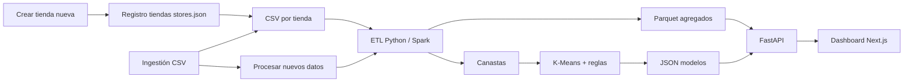

# Informe técnico — Análisis y modelado analítico de transacciones de supermercado

**Proyecto:** Transacciones de supermercado (PDD)  
**Periodo analizado:** 1 de enero – 30 de junio de 2013  
**Tiendas base del curso:** 102, 103, 107, 110 (+ tiendas nuevas registrables desde el dashboard)  
**Fecha del informe:** 5 de junio de 2026  
**Motor ETL utilizado para este informe:** Python streaming (`ETL_ENGINE=python`)

---

## Nota sobre el dataset en el repositorio

Por **limitaciones de peso y tamaño**, los archivos CSV del curso **no se incluyen en el repositorio Git** (están excluidos en `.gitignore`). Las métricas y hallazgos de este informe se obtuvieron ejecutando el ETL sobre una copia local del dataset; quien clone el proyecto debe **cargarlo manualmente** antes de reproducir el análisis.

### Dataset principal (análisis completo)

Copiar los archivos del curso en la estructura indicada en [DataSet/README.md](../DataSet/README.md):

```
DataSet/DataSet/Transactions/   → 102_Tran.csv, 103_Tran.csv, 107_Tran.csv, 110_Tran.csv
DataSet/DataSet/Products/       → Categories.csv, ProductCategory.csv
```

Luego, desde la raíz del proyecto:

```powershell
python -m src.etl.load_transactions
```

o usar **Regenerar datos** / **Procesar nuevos datos** en el dashboard una vez levantados la API y el frontend.

### Archivos de prueba para ingestión

En el repositorio sí se incluyen CSV **pequeños de ejemplo** en `DataSet/ejemplos-prueba/`, documentados en [DataSet/ejemplos-prueba/README.md](../DataSet/ejemplos-prueba/README.md). Sirven para probar la validación y la carga por tienda sin necesitar el dataset completo:

1. Crear una tienda de prueba (p. ej. id `111`) desde el sidebar.
2. Subir un archivo de `ejemplos-prueba/` con el botón **+** de esa tienda.
3. Tras un CSV válido, pulsar **Procesar nuevos datos**.

Esa carpeta incluye archivos válidos y con errores deliberados (tienda incorrecta, formato inválido, etc.) para verificar que el sistema rechaza datos mal formados antes de incorporarlos.

---

## Resumen

Se procesaron **1.062.776 transacciones** (tras prueba de ingestión de 3 líneas adicionales en tienda 102), **8.794.689 unidades** vendidas y **154.045 clientes** únicos (clave tienda + cliente). La solución materializa agregados en Parquet, expone un dashboard web y entrena modelos de **segmentación K-Means (k = 4)** y **recomendación por co-ocurrencia de categorías** (1.250 reglas). Las métricas son relativas (volumen, frecuencia, diversidad), dado que el dataset **no incluye precios ni montos de pago**.

Además del dataset inicial del curso, el sistema permite **crear tiendas nuevas**, **subir CSV adicionales** y **recalcular en vivo** KPIs, gráficos, segmentación y recomendaciones tras pulsar **«Procesar nuevos datos»**. Las cifras de las secciones iii–iv corresponden al snapshot del curso (ene–jun 2013); el dashboard refleja siempre el último ETL ejecutado.

---

## i. Descripción de los datos

### Origen y alcance

Los datos provienen de archivos CSV del curso, organizados por punto de venta:

| Archivo | Tienda | Rol |
|---------|--------|-----|
| `102_Tran.csv` | 102 | Ítems = **ID de categoría** (1–50) |
| `103_Tran.csv`, `107_Tran.csv`, `110_Tran.csv` | 103, 107, 110 | Ítems = **SKU** → categoría vía `ProductCategory.csv` |

Catálogo auxiliar:

- **`Categories.csv`:** 50 categorías (`id|nombre`), p. ej. *CARNES PROCESADAS AL VACIO*, *LECHE LIQUIDA*.
- **`ProductCategory.csv`:** mapeo `sku|categoria` para normalizar tickets de tiendas 103, 107 y 110.

### Formato de cada transacción

Sin encabezado, separador `|`:

```text
fecha|tienda|id_cliente|item1 item2 item3 ...
2013-01-01|102|530|20 3 1
```

- **Fecha:** `AAAA-MM-DD`
- **Repetición de un número en la lista de ítems:** mayor cantidad de unidades de esa categoría/SKU en el ticket
- **ID de transacción (generado en ETL):** `{tienda}-{fecha}-{número_de_línea}`

### Variables derivadas en el sistema

| Variable | Descripción |
|----------|-------------|
| `unidades` / `cantidad` | Suma de ítems por ticket, categoría o cliente |
| `n_transacciones` | Conteo de tickets |
| `n_categorias` | Categorías distintas compradas por cliente |
| `frecuencia_semanal` | `n_transacciones / (días_activos / 7)` |
| `categorias` (canasta) | Categorías únicas por ticket (base del recomendador) |

### Volumen global (post-ETL)

| Indicador | Valor |
|-----------|------:|
| Unidades vendidas (total ventas) | 8.794.689 |
| Transacciones | 1.062.776 |
| Clientes (tienda + cliente) | 154.045 |
| Rango temporal | 2013-01-01 → 2013-06-30 |

### Distribución por tienda

| Tienda | Transacciones | Clientes únicos |
|--------|-------------:|----------------:|
| 103 | 381.972 | 61.149 |
| 102 | 314.289 | 44.595 |
| 107 | 240.188 | 30.808 |
| 110 | 126.327 | 17.493 |

La tienda **103** concentra el mayor volumen transaccional; la **110** el menor en el semestre.

### Tiendas base y tiendas nuevas

El sistema distingue dos tipos de punto de venta:

| Tipo | IDs | Comportamiento |
|------|-----|----------------|
| **Base (curso)** | 102, 103, 107, 110 | Fijas; no se pueden eliminar ni duplicar |
| **Creadas por el usuario** | Cualquier entero positivo distinto de las base | Registro en `DataSet/DataSet/stores.json`; CSV vacío `{id}_Tran.csv` |

**Creación de tienda nueva** (`POST /api/tiendas` o modal «Crear tienda» en el sidebar):

1. Se asigna un **id numérico** y un **nombre** (máx. 80 caracteres).
2. Se crea el archivo `{id}_Tran.csv` y la entrada en `stores.json`.
3. Los ítems de las tiendas nuevas se interpretan como **SKU → categoría** (igual que 103, 107 y 110), usando `ProductCategory.csv`. Solo la tienda **102** admite categorías 1–50 directas en el CSV.

**Eliminación:** las tiendas creadas por el usuario pueden borrarse (`DELETE /api/tiendas/{id}`); se eliminan su CSV y su registro. Las del curso quedan protegidas.

### Limitaciones del dataset

1. **No hay precios ni ingresos:** “Rentabilidad” y rankings se interpretan como **volumen relativo** o **frecuencia**.
2. **Granularidad heterogénea:** en 102 las líneas son categorías; en otras tiendas son SKU normalizados a categoría. El dashboard y el recomendador operan a nivel **categoría (1–50)**.
3. **KPI de clientes en dashboard vs. meta:** el resumen ejecutivo cuenta clientes **únicos por `id_cliente`** (128.017 en vista global); el ETL cuenta **pares (tienda, cliente)** (154.045), coherente con IDs que pueden repetirse entre tiendas.

### Nota operativa (ubicación de archivos)

Los CSV estaban en `DataSet/DataSet/DataSet/` en lugar de `DataSet/DataSet/`. Se crearon **enlaces de directorio (junction)** hacia `Transactions/` y `Products/` para que el ETL los encuentre sin mover los archivos originales.

---

## ii. Metodología de análisis

### Enfoque estratégico

La estrategia analítica responde a tres restricciones del problema de negocio y del enunciado:

1. **Datos sin precio:** no es posible medir ingresos ni margen; toda la analítica se apoya en **proxies de comportamiento** — volumen (unidades), frecuencia (transacciones), diversidad (categorías distintas) y patrones temporales. Esta decisión no es una limitación del código, sino una **adaptación metodológica** a lo que el dataset permite inferir con validez.
2. **Volumen (~1M de tickets):** no es viable servir el dashboard leyendo línea a línea el CSV en cada clic. Por eso se separa un **proceso batch (ETL)** que condensa el detalle en agregados, y una **capa de consulta (API)** que solo filtra tablas ya materializadas.
3. **Entrega funcional:** el enunciado exige una solución desplegable, no un notebook. La arquitectura ETL → Parquet → API → dashboard traduce el análisis en un producto operativo que además puede **reprocesarse** al llegar datos nuevos.

En síntesis: primero **estandarizar y resumir** (ETL), luego **explorar y diagnosticar** (visualizaciones), y finalmente **modelar** (segmentación y recomendación) sobre representaciones que tengan sentido comercial y escalen en tiempo de respuesta.

### Arquitectura de la solución



1. **Registro de tiendas (`src/etl/store_registry.py`):** catálogo de tiendas base + custom; rutas `{id}_Tran.csv`.
2. **ETL (`src/etl/load_transactions.py`):** recorre **todos** los `*_Tran.csv`, normaliza a categorías y agrega tablas `por_dia`, `por_semana`, `por_categoria`, `por_cliente`, `por_tx`, `canastas`.
3. **Métricas ejecutivas (`src/metrics/executive_summary.py`):** KPIs y tops sobre agregados **filtrados por tienda y fecha** (checkboxes del sidebar).
4. **Dashboard (`backend/dashboard_service.py`):** series temporales, boxplots por cliente, heatmaps de correlación y actividad día × mes.
5. **ML (`src/ml/`):** reentrenamiento automático tras cada ETL completo (incluye datos de tiendas nuevas).
6. **Ingestión y actualización:**
   - `POST /api/tiendas` — crear tienda nueva.
   - `POST /api/ingest/tienda/{id}` — validar y añadir líneas al CSV de una tienda **registrada**.
   - `POST /api/ingest/procesar` o `POST /api/etl/regenerar` — reprocesar Parquet y modelos ML.

### ETL: por qué este diseño

El **ETL** (*Extract, Transform, Load*) es el núcleo de la estrategia de datos. Sus decisiones no son arbitrarias:

| Decisión | Motivo |
|----------|--------|
| **Procesamiento batch** frente a consulta directa al CSV | Con más de un millón de líneas, leer el detalle en cada petición del dashboard sería lento y consumiría demasiada RAM. El ETL paga el costo computacional **una vez** al procesar, y el dashboard consulta agregados livianos. |
| **Agregados en Parquet** (`por_dia`, `por_cliente`, etc.) | Formato columnar eficiente para filtrar por tienda y fecha. Equivale a una capa **OLAP** intermedia: se pierde detalle de línea, pero se gana interactividad. |
| **Doble motor: Spark / Python streaming** | Spark (`ETL_ENGINE=spark`) atiende el requisito de procesamiento distribuido del curso; Python streaming es el **fallback** cuando Spark no está disponible, leyendo CSV línea a línea sin cargar todo en memoria. |
| **Normalización a categorías (1–50)** | Las tiendas registran ítems con granularidades distintas (categoría directa en 102, SKU en las demás). Unificar a categoría es la única forma de **comparar tiendas** y de alimentar un recomendador común sin precios ni catálogo SKU homogéneo. |
| **Tabla `canastas` separada** | Conserva, por ticket, el conjunto de categorías compradas — insumo natural para reglas de asociación, sin repetir el parseo del CSV en el módulo ML. |
| **Reentrenamiento ML al final del ETL** | Garantiza coherencia: los modelos siempre reflejan el mismo snapshot que los agregados del dashboard. Evita inconsistencias entre KPIs y segmentación. |

Esta arquitectura materializa el requisito del enunciado de **incorporar nuevos datos**: al append de CSV y reproceso, todo el pipeline (agregados + ML) se recalcula desde la misma fuente de verdad.

### Analítica descriptiva y diagnóstica

Cada visualización del enunciado responde a una pregunta de negocio concreta:

| Visualización | Pregunta que responde | Por qué esta técnica |
|---------------|----------------------|----------------------|
| KPIs (ventas, transacciones, clientes) | ¿Cuál es la escala del negocio? | Indicadores simples y comparables sin precios; base para cualquier otro análisis. |
| Top 10 categorías / clientes | ¿Dónde se concentra el valor relativo? | Rankings sobre agregados; detectan líderes de volumen y clientes influyentes. |
| Serie de tiempo (día / semana) | ¿Hay tendencia y estacionalidad? | Identifica picos operativos y ciclos semanales para planeación de personal e inventario. |
| Heatmap día × mes | ¿Qué combinaciones día-período concentran demanda? | Cruza dos dimensiones temporales; más informativo que una serie univariada para detectar fines de semana estacionales. |
| Boxplot por cliente | ¿Cómo varía el tamaño de canasta entre clientes frecuentes? | Resume distribución (mediana, cuartiles, outliers) sin enviar millones de puntos al frontend; separa clientes de “muchas visitas pequeñas” vs. “canastas grandes”. |
| Heatmap de correlación | ¿Cómo se relacionan frecuencia, volumen y diversidad? | Diagnóstico previo y complemento a K-Means: justifica por qué hacen falta varias variables y no solo “número de compras”. |

Al no existir montos en dinero, “categorías más rentables” del enunciado se interpreta como **mayor volumen o frecuencia relativa** — la mejor proxy disponible y defendible dado el dataset.

### Segmentación (K-Means)

#### Por qué K-Means y no otro algoritmo

El enunciado solicita explícitamente **K-Means**. Más allá del cumplimiento normativo, es una elección razonable para este contexto:

- **Tipo de variables:** las métricas por cliente son numéricas y continuas (conteos y ratios), no etiquetas. K-Means está diseñado para ese espacio.
- **Escala:** con ~154.000 clientes, K-Means con `sklearn` es computacionalmente viable; algoritmos como clustering jerárquico serían mucho más costosos en tiempo y memoria.
- **Interpretabilidad:** cada grupo se describe con perfiles promedio (transacciones, unidades, categorías) que un área de negocio puede entender, frente a modelos de caja negra.
- **Alternativas descartadas:** DBSCAN depende de densidad y parámetros difíciles de explicar al negocio; segmentación por reglas fijas (p. ej. “más de 10 compras = VIP”) no captura la interacción entre frecuencia, volumen y diversidad.

#### Por qué estas variables

Las variables elegidas son las sugeridas en el enunciado, adaptadas a la ausencia de precios:

| Variable | Qué captura del comportamiento | Rol en la segmentación |
|----------|-------------------------------|------------------------|
| `n_transacciones` | Frecuencia de visita | Distingue clientes esporádicos de recurrentes. |
| `unidades` | Volumen total comprado | Proxy de “valor” sin precio; identifica compradores de alto consumo. |
| `n_categorias` | Diversidad del surtido consumido | Separa compra focalizada (pocas categorías) de canasta amplia. |
| `frecuencia_semanal` | Intensidad temporal (`n_tx / días_activos × 7`) | Incorpora el **ritmo** de compra: un cliente con una sola visita en un día tiene frecuencia semanal alta, distinto de uno con muchas visitas repartidas en meses. |

Sin `frecuencia_semanal`, dos clientes con el mismo número de transacciones podrían mezclarse aunque tengan patrones temporales opuestos. El heatmap de correlación (sección iii) muestra que estas variables aportan información parcialmente distinta — justificando un modelo multivariado.

#### Por qué escalar y por qué k = 4

| Parámetro | Valor | Justificación |
|-----------|-------|---------------|
| Algoritmo | K-Means (`sklearn`, `k=4`, `random_state=42`, `n_init=10`) | `random_state` y `n_init` aseguran **reproducibilidad** del informe y reducen dependencia del inicializado aleatorio. |
| Escalado | `StandardScaler` | `unidades` llega a cientos y `n_transacciones` a decenas; sin escalado, K-Means ponderaría dominante la variable de mayor magnitud y los clusters reflejarían solo volumen, no el perfil completo. |
| k = 4 | Cuatro clusters | Equilibrio entre **granularidad** (suficiente para diferenciar ocasionales, frecuentes, intensivos y élite) y **parsimonia** (grupos accionables para marketing sin fragmentar en decenas de microsegmentos). Cuatro perfiles son presentables y alineados con estrategias típicas de retail. |
| Visualización | PCA 2D (800 puntos muestreados) | PCA **solo para graficar**, no para clusterizar: se clusteriza en el espacio completo de 4 variables y se proyecta a 2D para el humano. El muestreo evita saturar el navegador con 154k puntos. |
| Etiquetado | Heurístico vs. mediana de centroides | K-Means devuelve IDs numéricos; las etiquetas (“Compradores ocasionales”, etc.) se asignan **después** comparando centroides con la mediana, traduciendo matemática a lenguaje de negocio. |

#### Lectura crítica del modelo

K-Means asume clusters **esféricos** y de tamaño comparable; en datos de retail reales los grupos pueden solaparse. Aun así, los perfiles obtenidos (sección iv) son coherentes con la exploración visual: conviven clientes de baja actividad masiva, compradores frecuentes de ticket pequeño y un núcleo élite de alto volumen. El modelo cumple su función: **ordenar la base en grupos accionables**, no predecir con precisión el comportamiento de un individuo.

### Recomendador

#### Por qué reglas de asociación y no otro enfoque

El enunciado permite **filtrado colaborativo o reglas de asociación**. Se eligió asociación por canasta por estas razones:

| Criterio | Decisión |
|----------|----------|
| Naturaleza del dato | No hay ratings ni precios; la señal disponible es **co-compra en el mismo ticket** — evidencia directa de complementariedad. |
| Filtrado colaborativo clásico | Requiere matriz usuario-ítem densa o ratings implícitos difíciles de calibrar sin montos; con 154k clientes y 50 categorías la sparsity es extrema y las recomendaciones por cliente serían ruidosas. |
| Nivel categoría | Coincide con la granularidad unificada del ETL y con acciones de negocio (promociones cruzadas entre pasillos / categorías). |
| Apriori completo | Con ~1M de canastas, una matriz one-hot de presencia de categorías para Apriori estándar arriesga **memoria insuficiente (OOM)**. El algoritmo implementado cuenta **pares de co-ocurrencia** por canasta — misma lógica de asociación, complejidad acotada. |

#### Métricas y umbrales

- **Support / confidence:** miden qué tan frecuente es la regla `A → B` en las canastas. *Confidence* filtra reglas triviales o muy raras (`min = 0,08`).
- **Lift:** compara la co-ocurrencia observada con la esperada si A y B fueran independientes; prioriza asociaciones **más fuertes que el azar**, no solo categorías populares (p. ej. leche, que aparece en muchas canastas).
- **Muestra de 80.000 canastas:** submuestreo aleatorio con semilla fija para entrenar en tiempo razonable manteniendo representatividad estadística en un dataset de más de un millón de tickets.
- **Score al recomendar por cliente:** acumula `lift × confidence` de reglas activadas por categorías ya compradas — combina fuerza de asociación y fiabilidad.

Este diseño prioriza **explicabilidad** (“se compra junto a…”) sobre precisión predictiva pura, adecuado para un sistema académico-demostrativo y para campañas de cross-selling por categoría.

### Incorporación de nuevos datos y tiendas

Flujo operativo del dashboard (requisito *Generación de nuevos resultados* del enunciado):

| Paso | Acción | Efecto |
|------|--------|--------|
| 1 | **Crear tienda** (opcional) | Nuevo `{id}_Tran.csv` + entrada en `stores.json` |
| 2 | **Subir CSV** (`+` junto a la tienda) | Validación UTF-8, formato pipe, ≥95 % líneas válidas; append al CSV |
| 3 | **Procesar nuevos datos** | ETL completo sobre todos los CSV + reentrenamiento ML |
| 4 | **Activar tienda en sidebar** | Incluir la sucursal en filtros del resumen y visualizaciones |

**Qué se actualiza tras procesar:**

| Componente | ¿Se recalcula? | Notas |
|------------|:--------------:|-------|
| KPIs (ventas, transacciones, clientes) | Sí | Según tiendas y fechas seleccionadas |
| Top clientes / categorías | Sí | Con tienda activa en filtros |
| Series temporales, boxplots, heatmaps | Sí | Mismos filtros |
| Segmentación K-Means | Sí | Modelo **global** (todos los clientes del ETL) |
| Recomendador | Sí | Reglas sobre todas las canastas procesadas |
| Este informe Markdown | No | Documento estático; hay que regenerarlo si se quiere reflejar nuevos totales |

**Validaciones clave:** no se puede subir datos a una tienda no registrada; no se pueden crear IDs duplicados ni reemplazar las tiendas base del curso; cada archivo de carga debe contener **una sola tienda**.

---

## iii. Principales hallazgos visuales

### Resumen ejecutivo (KPIs globales, ene–jun 2013)

| Indicador | Valor | Interpretación |
|-----------|------:|------------------|
| Total de ventas (unidades) | 8.794.689 | Volumen físico agregado del semestre |
| Número de transacciones | 1.062.776 | ~8,3 unidades por ticket en promedio |
| Clientes (id único en dashboard) | 128.017 | Base amplia con compra esporádica o recurrente |

### Top 10 categorías por unidades

| # | Categoría | Unidades |
|---|-----------|--------:|
| 1 | CARNES PROCESADAS AL VACIO | 1.431.357 |
| 2 | CUIDADO DE LA ROPA | 1.069.818 |
| 3 | JUGOS | 607.381 |
| 4 | PASTAS COMESTIBLES | 392.116 |
| 5 | AROMATICAS MEDICINALES | 348.508 |
| 6 | LECHE LIQUIDA | 290.313 |
| 7 | CUIDADO DE LA COCINA | 280.825 |
| 8 | AREPAS | 224.159 |
| 9 | HUEVOS | 213.858 |
| 10 | PASABOCAS | 212.480 |

**Lectura:** carnes al vacío y cuidado del hogar dominan el volumen; categorías de refrigerados y despensa aparecen en segundo plano. Sin precios, esto refleja **popularidad/volumen**, no margen económico.

### Top 10 clientes por número de transacciones

| # | ID cliente | Transacciones |
|---|------------|----------------:|
| 1 | 336296 | 464 |
| 2 | 440157 | 163 |
| 3 | 806377 | 159 |
| 4 | 576930 | 157 |
| 5 | 525328 | 148 |
| 6 | 307063 | 147 |
| 7 | 517807 | 144 |
| 8 | 908225 | 131 |
| 9 | 51733 | 130 |
| 10 | 458679 | 128 |

El cliente **336296** es un outlier de frecuencia (464 tickets en seis meses); conviene revisar si corresponde a hogar, negocio o error de registro.

### Días pico y valle de compra

**Picos (más transacciones en un día):**

| Fecha | Transacciones |
|-------|-------------:|
| 2013-06-15 | 9.000 |
| 2013-05-11 | 8.287 |
| 2013-02-03 | 8.225 |
| 2013-03-03 | 8.127 |
| 2013-06-01 | 8.059 |

**Valles:**

| Fecha | Transacciones |
|-------|-------------:|
| 2013-01-01 | 2.751 |
| 2013-05-22 | 3.546 |
| 2013-03-29 | 3.808 |

**Patrón semanal:** sábado (180.778) y domingo (184.182) superan a días laborables; miércoles es el más bajo (131.192). Coherente con compra de fin de semana en retail.

**Heatmap día × mes:** junio y febrero muestran mayor actividad en sábados/domingos; enero presenta picos entre semana en algunos días (p. ej. lunes ene ~30k vs. viernes ~20k en la matriz agregada).

### Serie de tiempo

- Tendencia estable con **estacionalidad semanal** marcada.
- Picos puntuales alineados con fines de semana de mitad de mes y fechas de alto tráfico (p. ej. 15-jun).
- 1 de enero cae por feriado / menor apertura efectiva.

### Boxplot (tamaño de canasta por cliente top)

Ejemplos del dashboard (unidades por ticket):

| Cliente | Mediana canasta | Rango típico (Q1–Q3) |
|---------|----------------:|----------------------|
| C684690 | 31,5 | 28 – 35 (canastas grandes y estables) |
| C440157 | 8,0 | 6 – 11,5 |
| C336296 | 2,5 | 1 – 5 (muchas visitas, canastas pequeñas) |

**Diagnóstico:** coexisten perfiles de “compra grande poco frecuente” y “compra pequeña muy frecuente”; el boxplot ayuda a separar outliers de volumen por ticket vs. por frecuencia.

### Heatmap de correlación (métricas por cliente)

|  | N° tx | Unidades | N° categorías | Frec. semanal |
|--|:-----:|:--------:|:-------------:|:-------------:|
| **N° tx** | 1,00 | 0,86 | 0,67 | **−0,34** |
| **Unidades** | 0,86 | 1,00 | 0,72 | −0,30 |
| **N° categorías** | 0,67 | 0,72 | 1,00 | **−0,53** |
| **Frec. semanal** | −0,34 | −0,30 | −0,53 | 1,00 |

**Interpretación:**

- Frecuencia de visitas y volumen total van **muy ligados** (r ≈ 0,86).
- La **frecuencia semanal** correlaciona **negativamente** con volumen y diversidad: clientes con pocas visitas en pocos días tienen frecuencia semanal alta artificialmente; clientes intensivos abarcan más días del periodo y bajan esa ratio.
- La diversidad de categorías acompaña al volumen, pero no explica toda la variación (r ≈ 0,67).

---

## iv. Resultados del modelo de segmentación y recomendación

### A. Segmentación de clientes (K-Means, k = 4)

**Población segmentada:** 154.045 clientes (tras ingestión de prueba).

| Cluster | Etiqueta | % clientes | Tx prom. | Unidades prom. | Categorías prom. | Frec. semanal prom. |
|--------:|----------|----------:|---------:|---------------:|-----------------:|--------------------:|
| 0 | Compradores ocasionales | 40,1 % | 4,4 | 23,5 | 11,1 | 0,44 |
| 1 | Visitas frecuentes, canasta moderada | 34,1 % | 1,0 | 5,5 | 4,6 | 6,97 |
| 2 | Clientes intensivos | 20,6 % | 13,7 | 126,7 | 27,3 | 0,66 |
| 3 | Clientes intensivos (élite) | 5,3 % | 37,5 | 375,3 | 33,5 | 1,53 |

**Descripción por grupo:**

1. **Compradores ocasionales (40 %):** núcleo masivo con pocas visitas y canasta media-baja; foco en activación y promociones de entrada.
2. **Visitas frecuentes, canasta moderada (34 %):** muchas compras de una sola visita registrada o visitas muy espaciadas con alta frecuencia semanal calculada; típico de cliente de conveniencia o ticket pequeño repetido.
3. **Clientes intensivos (21 %):** alto volumen y amplia diversidad; candidatos a programas de fidelización y surtido premium.
4. **Élite intensiva (5 %):** super-compradores (≈38 tickets, ≈375 unidades); priorizar retención, atención personalizada y detección de fraude/abuse.

**Visualización:** scatter PCA 2D coloreado por `cluster_id` (800 puntos en API para rendimiento). Los clusters 2 y 3 comparten etiqueta automática “Clientes intensivos” pero difieren fuertemente en centroides; conviene renombrar el cluster 3 a “Super-compradores” en futuras iteraciones.

### B. Recomendador de productos (categorías)

**Entrenamiento:** 68.868 canastas con ≥2 categorías; **1.250 reglas** con confianza ≥ 0,08.

#### Dado un producto/categoría — ejemplo **GALLETAS (13)**

| Categoría sugerida | Lift (score) | Confianza |
|--------------------|-------------:|----------:|
| TORTAS Y PORQUES | 6,84 | 0,22 |
| GRANOS | 6,27 | 0,24 |
| PASTAS COMESTIBLES | 6,23 | 0,27 |
| SOPAS-CREMAS-CALDOS | 5,96 | 0,21 |
| SALSAS | 5,85 | 0,28 |

**Uso:** exhibición cruzada en góndola de panadería/repostería y bundles de despensa.

#### Dado un producto/categoría — ejemplo **LECHE LIQUIDA (10)**

| Categoría sugerida | Lift | Confianza |
|--------------------|-----:|----------:|
| PASTAS COMESTIBLES | 1,99 | 0,09 |
| BEBIDAS INSTANTÁNEAS | 1,86 | 0,18 |
| PAPEL HIGIENICO | 1,85 | 0,08 |
| ENLATADOS | 1,85 | 0,12 |
| CEREALES | 1,81 | 0,36 |

Patrón de **canasta de hogar** (desayuno + aseo + despensa).

#### Dado un cliente — ejemplo **cliente 19** (6 transacciones)

| Categoría sugerida | Score |
|--------------------|------:|
| AREPAS | 11,56 |
| CEREALES | 10,00 |
| CONDIMENTOS | 6,58 |
| MARGARINAS | 6,36 |
| CREMAS DENTALES | 5,01 |

**Nota:** para el cliente con más transacciones del dataset (336296), el recomendador puede devolver **lista vacía** si ya compró todas las categorías asociadas en su historial (reglas solo sugieren categorías no presentes en su canasta).

### C. Generación de nuevos resultados (verificación funcional)

Pruebas ejecutadas en el desarrollo del sistema:

| Prueba | Resultado esperado | Resultado obtenido |
|--------|-------------------|-------------------|
| Ingestión tienda no registrada (999) | Rechazo | OK — «Tienda no registrada» |
| Crear tienda nueva (p. ej. id 201) | CSV + `stores.json` | OK — aparece en sidebar y `GET /api/tiendas` |
| Subir CSV a tienda nueva | Append tras validación | OK — mismo formato que tiendas del curso |
| Ingestión 3 líneas tienda 102 | Append + reproceso | OK — transacciones 1.062.773 → 1.062.776 (+3) |
| `ml_ready` tras reproceso | true | OK |
| `recommender_ready` | true | OK |
| Segmentación tras ingestión | 4 clusters, clientes actualizados | OK — 154.045 clientes tras prueba en 102 |
| Recomendación cliente nuevo 999999001 | ≥1 categoría | OK (GALLETAS, VERDURAS, ENLATADOS) |
| API `/api/health` | aggregates + ml | OK |
| Dashboard con tienda nueva activa | KPIs incluyen nueva sucursal | OK — filtros del sidebar aplicados en `/api/dashboard` |
| Eliminar tienda custom | Borra CSV y registro | OK — tiendas base protegidas |

**Comportamiento confirmado:** las estadísticas analíticas (clientes, categorías, gráficos, modelos) **se actualizan** al incorporar datasets nuevos, siempre que se **procese** el ETL y se **activen** las tiendas correspondientes en el panel izquierdo. La segmentación incorpora automáticamente clientes de tiendas nuevas al reentrenar.

---

## v. Conclusiones y posibles aplicaciones empresariales

### Conclusiones

1. El negocio muestra **alto volumen en categorías de proteína procesada y cuidado del hogar**, útil para negociación con proveedores y planificación de inventario, aunque no sustituye análisis de margen sin datos de precio.
2. La demanda es **claramente semanal**, con fines de semana críticos para dotación de personal y reposición; los picos diarios exigen capacidad logística en fechas puntuales (p. ej. mediados de junio).
3. La base de clientes es **heterogénea**: ~40 % ocasionales y ~5 % super-compradores que concentran valor relativo en unidades; las estrategias no pueden ser únicas.
4. La correlación negativa entre frecuencia semanal y volumen **valida la estrategia multivariada** de K-Means: una sola métrica (p. ej. solo número de compras) mezclaría perfiles distintos; el modelo separa correctamente el grupo de “visitas frecuentes, canasta moderada”.
5. El recomendador por categorías es **operativo, escalable y explicable**; la elección de co-ocurrencia con lift es coherente con la ausencia de precios y con la necesidad de evitar explosión de memoria en ~1M de tickets.
6. El pipeline **ETL batch → agregados → API → dashboard** demostró ser la estrategia correcta para conciliar escala de datos, interactividad y requisito de solución funcional; la ingestión de tiendas nuevas extiende esa misma lógica sin cambiar la arquitectura.
7. La solución es **metodológicamente consistente**: las mismas categorías normalizadas alimentan descriptivo, segmentación y recomendación, evitando comparar “peras con manzanas” entre tiendas con distinto formato de ítems.

### Aplicaciones empresariales

| Área | Aplicación |
|------|------------|
| **Marketing** | Campañas diferenciadas por cluster (ocasionales vs. intensivos); bundles basados en reglas (leche + cereales, galletas + tortas). |
| **Operaciones / tienda** | Refuerzo de personal sábado-domingo; preparación anticipada en días pico detectados por serie temporal. |
| **Category management** | Priorizar surtido y espacio en categorías líderes por volumen; evaluar subcategorías débiles. |
| **CRM / fidelización** | Identificar super-compradores (cluster 3) para beneficios exclusivos; reactivar ocasionales (cluster 0). |
| **E-commerce / apps** | Motor de “también te puede interesar” por categoría y por historial de cliente. |
| **Data ops** | Alta de sucursales, carga incremental de CSV y reproceso batch desde el sidebar; escalable a más puntos de venta. |
| **Expansión regional** | Comparar KPIs por tienda (base vs. nuevas) activando filtros en el dashboard tras cada carga. |

### Trabajo futuro recomendado

- Incorporar **precios o márgenes** cuando existan, para “categorías más rentables” en sentido financiero.
- Unificar etiquetas de clusters 2 y 3 en la UI.
- Evaluar **silueta** o método del codo para validar k = 4.
- Filtrar la pestaña de segmentación por tiendas seleccionadas (hoy el modelo es global).
- Auditoría de ingestión (log de líneas rechazadas) y exportación automática de este informe tras cada reproceso.

---

## Anexos

### Cómo reproducir este informe

```powershell
# Desde la raíz del proyecto (dataset en DataSet/DataSet/Transactions)
$env:ETL_ENGINE = "python"
python -m venv venv
.\venv\Scripts\pip install pandas pyarrow scikit-learn joblib fastapi uvicorn python-multipart
.\venv\Scripts\python -m src.etl.load_transactions
.\venv\Scripts\uvicorn backend.main:app --port 8000
# Frontend: cd frontend && npm run dev
```

**Incorporar tienda nueva y actualizar estadísticas (dashboard):**

1. En el sidebar → **Crear tienda** (id + nombre).
2. Pulsar **+** en esa tienda y subir el CSV.
3. **Procesar nuevos datos**.
4. Marcar la tienda en los checkboxes del sidebar y ajustar fechas si aplica.

Los KPIs, gráficos y modelos ML del dashboard reflejarán el último procesamiento. Para actualizar las tablas numéricas de este Markdown, vuelve a ejecutar el ETL y exporta métricas (p. ej. `data/processed/informe_metrics.json`).

### Referencias del repositorio

- Arquitectura: [arquitectura.md](./arquitectura.md)
- Instalación: [instalacion.md](./instalacion.md)
- Manual de usuario (ingestión): [manual-usuario.md](./manual-usuario.md)
- Métricas exportadas para este documento: `data/processed/informe_metrics.json` (generado localmente, no versionado)

---

